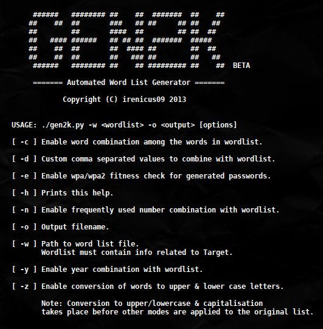

Gen2k BETA
==========

Gen2k aims to be a smart word list generator, it takes a list of sample words as input. 
Sample words can be anything that you know about the target, from area, date of birth to names & special events, etc. 
Once a list of all known words have been supplied to Gen2k, it automatically, based on the options set determines the best possible way to make a word list.
As many of you know, people tend to use birth year, specific dates, random numbers, custom words attached to simple words in order to make their passwords more complex. 
Gen2k aims to exploit those types of weaknesses along with conversion of words to different case combination to make your word list completely personalized & appropriate for the situation.

FEATURES
========

* Generates password combinations by combining supplied words.
* Mixes frequently used number patterns with words.
* Generates password combinations using year/date combo.
* Mixes custom user defined value(s) combination with words.
* Option to auto convert words to upper/lowercase & capitalisation.
* WPA/WPA2 password validation check.
* No external dependencies.

